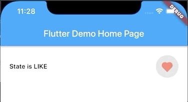

# claps_button

**claps_button** widget for Flutter project.



## Getting Started

For use **claps_button** widget in your project:
1. Add dependency in the **pubspec.yaml** file
```dart
    dependencies:
        flutter:
            sdk: flutter
        claps_button:
            git:
                url: git@github.com:shekunsky/FLUTTER-claps_button.git
```

2. Import widget in the dart file:
```dart
    import 'package:claps_button/claps_button.dart';
    import 'package:claps_button/claps_state.dart';
```

3. Make an instance of the widget.

    ```dart
         ClapsButton(
                state: ClapsState.unLike,
                onTapClapsed: (state) {
                  if (state == ClapsState.like) {
                    print('like');
                  } else {
                    print('unlike');
                  }
                },
              )
    ```
    
    
    ## License

    Windmill Smart Solutions 2020 ©